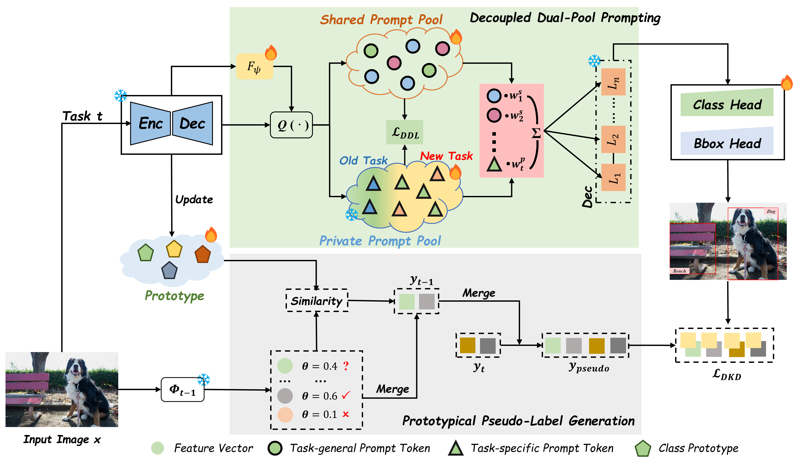

# PDP-IOD：Beyond Prompt Degradation: Prototype-guided Dual-pool Prompting for Incremental Object Detection

*Figure 1:Overview of our PDP framework at incremental step $t$. Given an image $x$, the query function generates a content-aware query representation by adaptively computing query weights via a ranking function $F_\psi$ and performing weighted aggregation. Subsequently, prompts are retrieved from both the shared and private pool and injected into the decoder layer. In parallel, the teacher model $\Phi_{t-1}$ generates a set of candidate bounding boxes, where potentially valuable ones are projected into the feature space to compute their similarity with class prototypes. This process yields a set of refined, high-quality pseudo-labels to guide the training of the student model $\Phi_t$.*

This repository contains the official implementation of the paper:

## Abstract
Incremental Object Detection (IOD) aims to continuously learn new object categories without forgetting previously learned ones. Recently, prompt-based methods have gained popularity for their replay-free design and parameter efficiency. However, due to prompt coupling and prompt drift, these methods often suffer from prompt degradation during continual adaptation.
To address these issues, we propose a novel prompt-decoupled framework called PDP. PDP innovatively designs a dual-pool prompt decoupling paradigm, which consists of a shared pool used to capture task-general knowledge for forward transfer, and a private pool used to learn task-specific discriminative features.
This paradigm explicitly separates task-general and task-specific prompts, preventing interference between prompts and mitigating prompt coupling.
In addition, to counteract prompt drift resulting from inconsistent supervision where old foreground objects are treated as background in subsequent tasks, PDP introduces a Prototypical Pseudo-Label Generation (PPG) module. PPG can dynamically update the class prototype space during training and use the class prototypes to further filter valuable pseudo-labels, maintaining supervisory signal consistency throughout the incremental process.
PDP achieves state-of-the-art performance on MS-COCO (with a 9.2\% AP improvement) and PASCAL VOC (with a 3.3\% AP improvement) benchmarks, highlighting its potential in balancing stability and plasticity.

