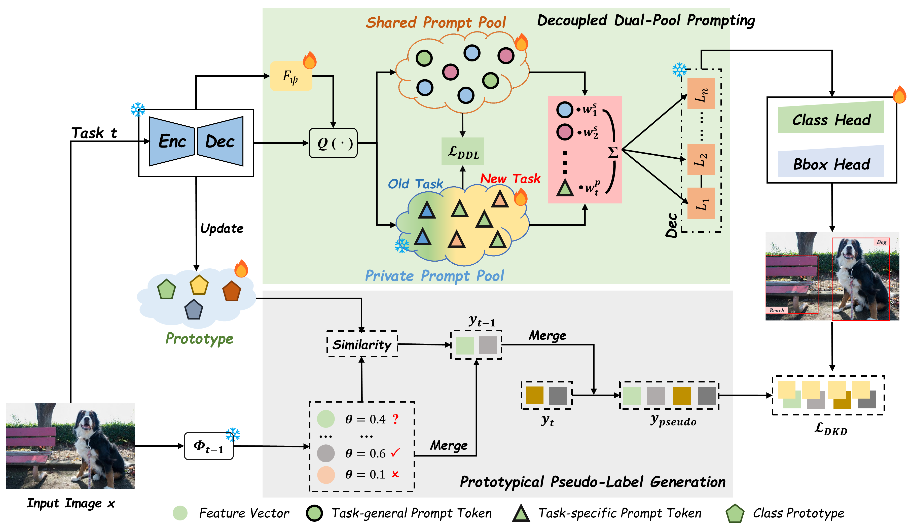

<h1 align="center">Beyond Prompt Degradation: Prototype-guided Dual-pool Prompting for Incremental Object Detection</h1>
<h2 align="center">🎉 Accepted at CVPR 2026 🎉</h2>
<p align="center">
Official implementation of <b>PDP</b>: Prototype-guided Dual-pool Prompting for Incremental Object Detection
</p>

[](https://opensource.org/licenses/MIT)
[](https://www.python.org/downloads/release/python-380/)

---

## 🔥 Introduction

Incremental Object Detection (IOD) aims to continuously learn new object categories without forgetting previously learned ones.

Recent prompt-based IOD methods are replay-free and parameter-efficient. However, they suffer from two critical issues:

- **Prompt Coupling**: Task-general and task-specific prompts interfere with each other.
- **Prompt Drift**: Inconsistent supervision causes old categories to degrade.

To address these challenges, we propose PDP, a prompt-decoupled continual detection framework that explicitly separates transferable and task-specific knowledge while maintaining supervision consistency across incremental steps.

---
<p align="center">
  
</p>

## 🧠 Key Contributions

### 1️⃣ Dual-Pool Prompt Decoupling
- **Shared Prompt Pool**: captures task-general transferable knowledge
- **Private Prompt Pool**: learns task-specific discriminative features
- Explicit decoupling mitigates prompt interference

### 2️⃣ Prototypical Pseudo-Label Generation (PPG)
- Dynamically maintains class prototype space
- Filters teacher-generated pseudo labels using prototype similarity
- Ensures supervision consistency during incremental training

---

## 📊 Results

| Dataset | Setting | Performance Gain |
|----------|----------|----------------|
| MS-COCO | 21+19+20+20 | +9.2% AP |
| PASCAL VOC | 19+1 | +3.3% AP |

PDP achieves state-of-the-art performance while remaining replay-free and parameter-efficient.

---

## 🏗️ Installation

```bash

git clone https://github.com/zyt95579/PDP_IOD
cd PDP_IOD
conda create -n pdp python=3.8 -y
conda activate pdp
pip install -r requirement.txt
```

## 🚀 Usage
###  🏋️ Training

```bash

bash run.sh
```
###  🏋️ Testing
To evaluate the trained model on the test set, first modify the run.sh script:
Change the parameter train=1 to train=0
Then run the same command:
```bash

bash run.sh
```
## 📝 Citation
If you find this repo useful, please cite:
```bash
@inproceedings{zhang2026beyond,
  title={Beyond Prompt Degradation: Prototype-guided Dual-pool Prompting for Incremental Object Detection},
  author={Zhang, Yaoteng and Zhou, Qing and Gao, Junyu and Wang, Qi},
  booktitle={Proceedings of the IEEE/CVF Conference on Computer Vision and Pattern Recognition},
  pages={27568--27578},
  year={2026}
}
```
